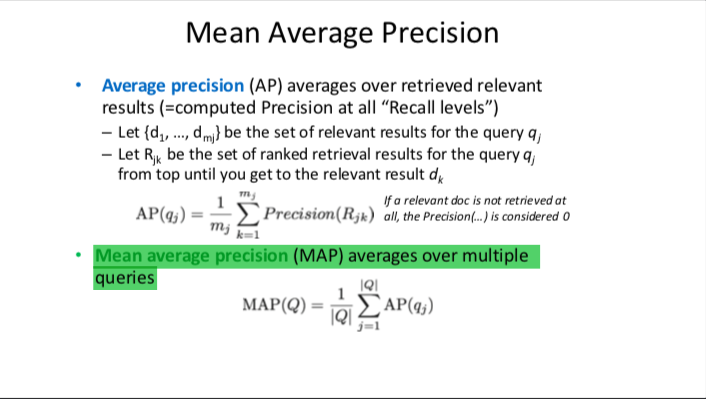
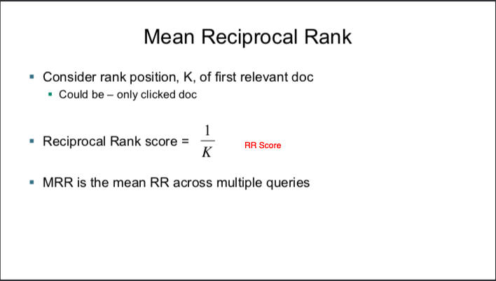
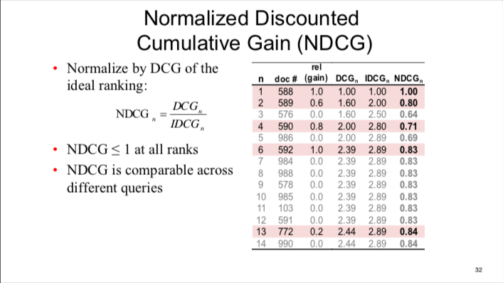
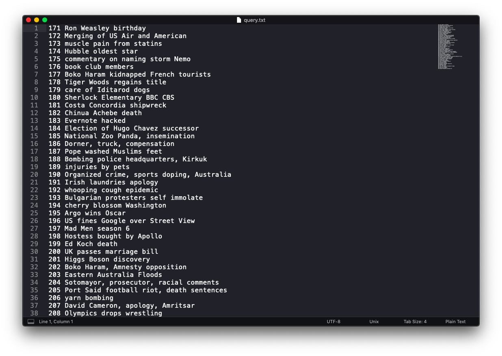
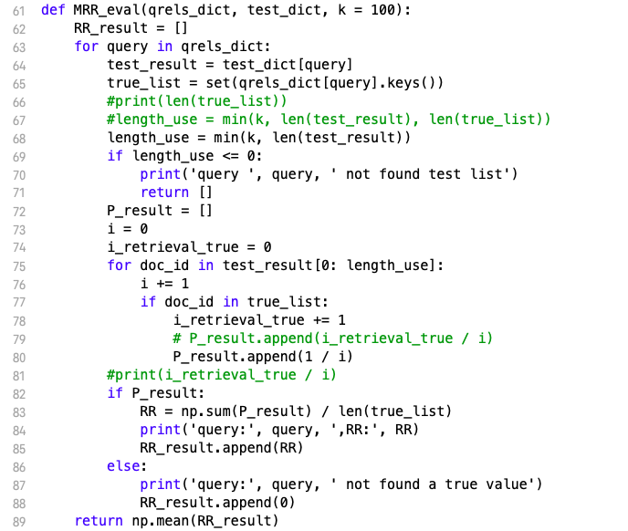
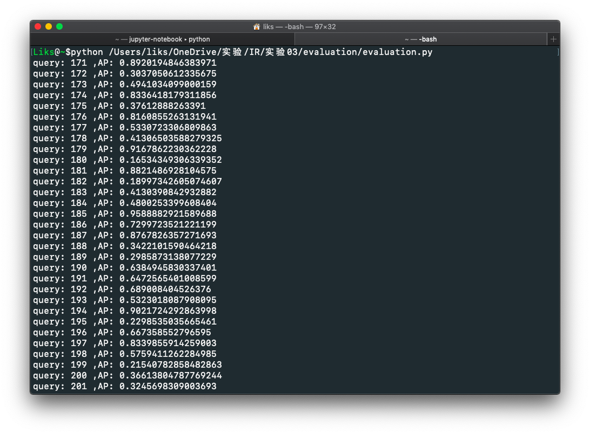

#  实验三 - 评价

## 实验目标：
    实现以下指标评价，并对HW1.2检索结果进行评价：
    1、MeanAveragePrecision(MAP)
    2、MeanReciprocalRank(MRR)
    3、NormalizedDiscountedCumulativeGain(NDCG)

## 实验过程：
    〇、评价指标解释
        MAP
            
            
        MRR
            
        NDCG
            

    一、获取查询query
    从数据集链接获取查询文本，从中q提取出需要查询的query：
    
    
    二、添加MRR函数
    
    
    三、对query进行查询并输出到需要的格式

    四、结果评价
    
    最后的结果为：
    MAP = 0.6359019648999682
    MRR = 0.06817075677293091
    NDCG = 0.7214928439964421
## 实验评价：

    这次实验比较简单，但检查出来了之前实验的一些小问题，
    比如上次实验最后将分数除了每个文档的长度的错误，在这次实验中被发现并修改。
    这也说明了以后实验有一个评价指标的重要性。
    
