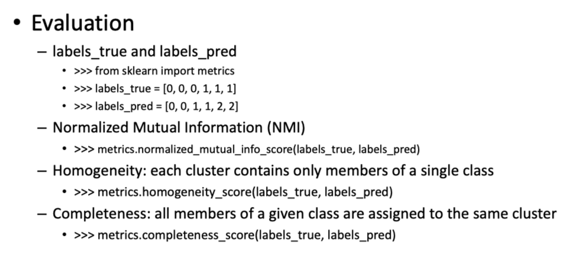

#  实验2 Clustering with sklearn

## 实验任务：
    测试sklearn中以下聚类算法在digits手写数字数据集和文本数据集上的聚类效果。
    
    使用不同的评估方法对结果进行评估。
    
    
## 实验过程：
### 关于 Scikit-learn:
> scikit-learn is a Python module for machine learning built on top of SciPy and is distributed under the 3-Clause BSD license.

### 安装需要pip或者conda：
> pip install -U scikit-learn
    或
> conda install scikit-learn

### 常用的算法：
    库的算法主要有四类：分类，回归，聚类，降维。其中：
    常用的回归：线性、决策树、SVM、KNN ；集成回归：随机森林、Adaboost、GradientBoosting、Bagging、ExtraTrees
    常用的分类：线性、决策树、SVM、KNN，朴素贝叶斯；集成分类：随机森林、Adaboost、GradientBoosting、Bagging、ExtraTrees
    常用聚类：k均值（K-means）、层次聚类（Hierarchical clustering）、DBSCAN
    常用降维：LinearDiscriminantAnalysis、PCA

    在本次实验主要用到了K-means算法，这是一个通过每个点到类中心距离不断做迭代的算法。
### 实验中涉及的聚类算法：
#### k-means
    '''
    当任意一个点的簇分配结果发生改变时
    对数据集中的每个数据点
    对每个质心
    计算质心与数据点之间的距离
    将数据点分配到最近的簇
    对每个簇，计算簇中所有点的均值并将均值作为质心
    '''
    sklearn 中K-means的主要参数：
        1) n_clusters: 设定的k值
        2）max_iter： 最大的迭代次数，一般如果是凸数据集的话可以不管这个值，如果数据集不是凸的，可能很难收敛，此时可以指定最大的迭代次数让算法可以及时退出循环。
        3）n_init：用不同的初始化质心运行算法的次数。由于K-Means是结果受初始值影响的局部最优的迭代算法，因此需要多跑几次以选择一个较好的聚类效果，默认是10。如果你的k值较大，则可以适当增大这个值。
        4）init： 即初始值选择的方式，可以为完全随机选择'random',优化过的'k-means++'或者自己指定初始化的k个质心。一般建议使用默认的'k-means++'。
        5）algorithm：有“auto”, “full” or “elkan”三种选择。"full"就是我们传统的K-Means算法， “elkan”elkan K-Means算法。默认的"auto"则会根据数据值是否是稀疏的，来决定如何选择"full"和“elkan”。一般来说建议直接用默认的"auto"
#### Affinity Propagation
    AP算法的主要思想是通过数据点两两之间传递的信息进行聚类。
    该算法的主要优点是能够自主计算聚类的数目，而不用人为制定类的数目。
    其缺点是计算复杂度较大 ，计算时间长同时空间复杂度大，
    因此该算法适合对数据量不大的问题进行聚类分析。
    数据点之间传递的信息包括两个，吸引度（responsibility）r(i,k)和归属度（availability）a(i,k)。
    吸引度r(i,k)度量的是质心k应当作为点i的质心的程度，
    归属度a(i,k)度量的是点i应当选择质心k作为其质心的程度。
#### Mean Shift
    算法大致流程为：随机选取一个点作为球心，以一定半径画一个高维球（数据可能是高维的），
    在这个球范围内的点都是这个球心的邻居。这些邻居相对于球心都存在一个偏移向量，
    将这些向量相加求和再平均，就得到一个mean shift，起点在原球心，重点在球内的其他位置。
    以mean shift的重点作为新的球心，重复上述过程直至收敛。
#### 层次聚类
    sklearn中实现的是自底向上的层次聚类，实现方法是sklearn.cluster.AgglomerativeClustering。
    初始时，所有点各自单独成为一类，然后采取某种度量方法将相近的类进行合并，并且度量方法有多种选择。
    合并的过程可以构成一个树结构，其根节点就是所有数据的集合，叶子节点就是各条单一数据。
    sklearn.cluster.AgglomerativeClustering中可以通过参数linkage选择不同的度量方法，用来度量两个类之间的距离，
#### DBSCAN
    DBSCAN算法的主要思想是，认为密度稠密的区域是一个聚类，各个聚类是被密度稀疏的区域划分开来的。
    也就是说，密度稀疏的区域构成了各个聚类之间的划分界限。与K-means等算法相比，该算法的主要优点包括：可以自主计算聚类的数目，不需要认为指定；不要求类的形状是凸的，可以是任意形状
#### GMM
    高维数据依然可以使用混合高斯分布，精力关系这里不详细研究，不过要记得高斯模型拓展到高维依然成立，需要时再推。
    
    

### 评价指标
#### 外部度量：
    利用条件熵定义的同质性度量：
    sklearn.metrics.homogeneity_score:每一个聚出的类仅包含一个类别的程度度量。
    sklearn.metrics.completeness:每一个类别被指向相同聚出的类的程度度量。
    sklearn.metrics.v_measure_score:上面两者的一种折衷：
    v = 2 * (homogeneity * completeness) / (homogeneity + completeness)
    可以作为聚类结果的一种度量。
    sklearn.metrics.adjusted_rand_score:调整的兰德系数。
    ARI取值范围为[-1,1],从广义的角度来讲，ARI衡量的是两个数据分布的吻合程度
    sklearn.metrics.adjusted_mutual_info_score:调整的互信息。
    利用基于互信息的方法来衡量聚类效果需要实际类别信息，MI与NMI取值范围为[0,1],AMI取值范围为[-1,1]。
#### 内部度量（在真实的分群label不知道的情况下）
    Calinski-Harabaz Index：
    在scikit-learn中， Calinski-Harabasz Index对应的方法是metrics.calinski_harabaz_score.
    CH指标通过计算类中各点与类中心的距离平方和来度量类内的紧密度，通过计算各类中心点与数据集中心点距离平方和来度量数据集的分离度，CH指标由分离度与紧密度的比值得到。从而，CH越大代表着类自身越紧密，类与类之间越分散，即更优的聚类结果。
    sklearn.metrics.silhouette_score:轮廓系数
    silhouette_sample
    对于一个样本点(b - a)/max(a, b)
    a平均类内距离，b样本点到与其最近的非此类的距离。
    silihouette_score返回的是所有样本的该值,取值范围为[-1,1]。
    这些度量均是越大越好
### 实验中用到的数据集：
    实验中用到了sklearn内置的手写数据集，我们先对这个数据集进行一个初步的了解：
    手写数字数据集包含1797个0-9的手写数字数据，每个数据由8*8大小的矩阵构成，矩阵中值的范围是0-16，代表颜色的深度。
    
    
    实验第二部分用到了内置的短新闻文本数据集，整个数据集有20个类，这里只取4个类进行聚类研究。
    

### 图像数据聚类：
    sklearn聚类算法使用demo：
    地址：https://scikit-learn.org/stable/auto_examples/cluster/plot_kmeans_digits.html#sphx-glr-auto-examples-cluster-plot-kmeans-digits-py
    
    这里的核心代码就是
    '''
    def bench_k_means(estimator, name, data):
        t0 = time()
        estimator.fit(data)
        print('%-9s\t%.2fs\t%i\t%.3f\t%.3f\t%.3f\t%.3f\t%.3f\t%.3f'% (name, (time() - t0), estimator.inertia_,
            metrics.homogeneity_score(labels, estimator.labels_),
            metrics.completeness_score(labels, estimator.labels_),
            metrics.v_measure_score(labels, estimator.labels_),
            metrics.adjusted_rand_score(labels, estimator.labels_),
            metrics.adjusted_mutual_info_score(labels,  estimator.labels_,
            average_method='arithmetic'),
            metrics.silhouette_score(data, estimator.labels_,
            metric='euclidean',
            sample_size=sample_size)))
    '''
    这段代码实际上就是求应用某种聚类方法后的各种评价分数。得益于sklearn对算法的封装，可以采用这种直接写一个表的思路构造代码。
    对上述代码进行改造，适用于实验任务中的各种聚类算法，并修改评价指标，跳过不适用的项目：
    '''
    def bench_k_means(estimator, name, data):
        t0 = time()
        estimator.fit(data)
        if isinstance(estimator,GaussianMixture):
        estimator.labels_ = estimator.predict(data)
        print('%-9s\t%.2fs\t%i\t%.3f\t%.3f\t%.3f\t%.3f\t%.3f\t%.3f\t%.3f'
        % (name, (time() - t0), estimator.inertia_ if hasattr(estimator, 'inertia_') else 0,
            metrics.homogeneity_score(labels, estimator.labels_),
            metrics.completeness_score(labels, estimator.labels_),
            metrics.v_measure_score(labels, estimator.labels_),
            metrics.adjusted_rand_score(labels, estimator.labels_),
            metrics.adjusted_mutual_info_score(labels,  estimator.labels_,
            average_method='arithmetic'),
            metrics.normalized_mutual_info_score(labels,  estimator.labels_,
            average_method='arithmetic'),
            metrics.silhouette_score(data, estimator.labels_,
            metric='euclidean',
            sample_size=sample_size)))
    '''
    计算每种聚类方法：
    '''
        print("n_digits: %d, \t n_samples %d, \t n_features %d"
        % (n_digits, n_samples, n_features))
        
        print(90 * '_')
        print('init\t\ttime\tinertia\thomo\tcompl\tv-meas\tARI\tAMI\tNMI\tsilhouette')
        
        bench_k_means(KMeans(init='k-means++', n_clusters=n_digits, n_init=10),
        name="k-means++", data=data)
        bench_k_means(KMeans(init='random', n_clusters=n_digits, n_init=10),
        name="random", data=data)
        # in this case the seeding of the centers is deterministic, hence we run the
        # kmeans algorithm only once with n_init=1
        # PCA降维之后再做KMEANs
        pca = PCA(n_components=n_digits).fit(data)
        bench_k_means(KMeans(init=pca.components_, n_clusters=n_digits, n_init=1),
        name="PCA-based",
        data=data)
        bench_k_means(KMeans(init='random', n_clusters=n_digits, n_init=10),
        name="random", data=data)
        bench_k_means(AffinityPropagation(),name="A.P.", data=data)
        bandwidth = estimate_bandwidth(data, quantile=0.1)
        bench_k_means(MeanShift(bandwidth=bandwidth, bin_seeding=True),name="MeanShift",data=data)
        bench_k_means(AgglomerativeClustering(n_clusters=10, linkage='ward'),name="W.H.C.",data=data)
        bench_k_means(AgglomerativeClustering(),name="A.C.",data=data)
        bench_k_means(DBSCAN(),name="DBSCAN",data=data)
        bench_k_means(GaussianMixture(n_components=n_digits),name="GMM",data=data)
        bench_k_means(SpectralClustering(),name="SC",data=data)
        print(90 * '_')
    '''
    得到各项指标评价结果：
    
    最后一项SpectralClustering运行时间比较长。

### 将聚类结果可视化输出：
    将数据PCA分解降到两维，再次进行Kmeans，GMM以及DBSCAN聚类，将不同类的点分别标出来：
    
    
    
    
    
    可以看到Kmeans在这类数据上表现比较好。
    
### 对文本的聚类效果

    sklearn同样给出了文本聚类的demo：
    地址：https://scikit-learn.org/stable/auto_examples/text/plot_document_clustering.html#sphx-glr-autoexamples-text-plot-document-clustering-py
    对文本的聚类要先对文本做向量化m，转化成向量序列之后才能做进一步的聚类。
    
    
    
    同样可以应用各种聚类方法，最后得出来的效果如下：
    
    
    K-means++的效果依然比较好

### 实验结果
    每种聚类方法都有各自的特点，在本次实验中，kmeans表现比较好，我觉得原因一方面这次实验数据比较简单，另一方面kmeans是一个无参的模型，健壮性较好。我在实验中没有仔细调整其他模型的参数，这可能是表现不如kmeans的一个原因。

### 参考
    1.《常用聚类以及聚类的度量指标》https://www.jianshu.com/p/841ecdaab847
